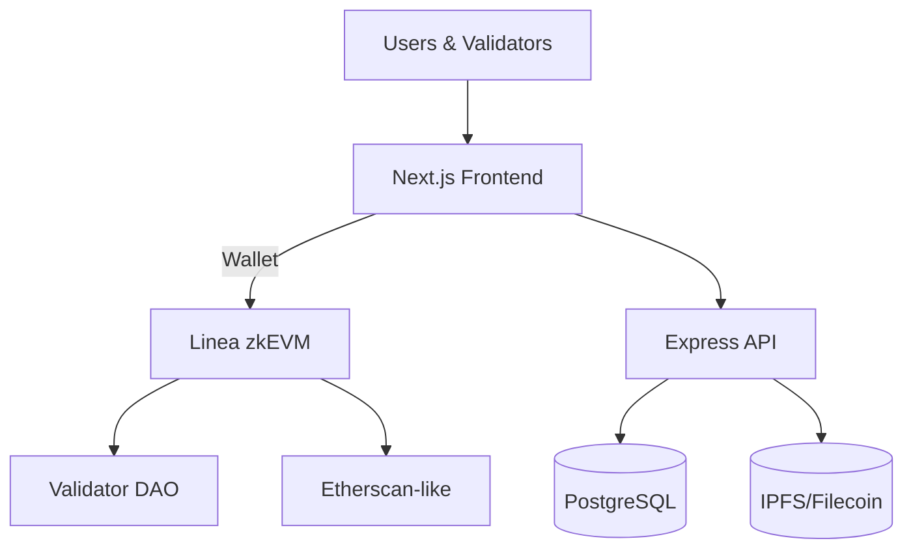

# DeedChain – On‑Chain Land Registry and Tokenization Platform

DeedChain is a full‑stack Web3 platform that turns land and property rights into verifiable digital assets. Title deeds are issued as NFTs, verified by a validator DAO, transferable via smart contracts, and optionally fractionalized into ERC‑20 tokens for inclusive investment.

This README provides a complete overview for founders, developers, and integrators: the problem we solve, architecture, tech stack, setup, APIs, smart contracts, and roadmap.

## Why DeedChain
- **Problem**: Land fraud, duplicate sales, forged titles, slow/opaque transfers, and inaccessible investment opportunities.
- **Solution**: An immutable, transparent on‑chain registry with DAO‑verified deed minting, smart‑contract transfers, and tokenization.
- **Impact**: Reduces fraud, speeds transfers, enables collateralization, and opens fractional real‑estate investment.

## Key Features
- **NFT Deeds (ERC‑721)**: Each parcel is a unique token with IPFS‑backed metadata (coordinates, documents, survey data).
- **Verification Layer (DAO)**: Surveyors, lawyers, and/or officials verify registrations and disputes.
- **Smart Transfers**: Buyer/seller/validator approvals; on‑chain, auditable, final.
- **Fractionalization (ERC‑20)**: Convert an NFT deed into tradable “LandShares.”
- **Public Verification**: Anyone can verify ownership with token ID or parcel reference.
- **Developer‑friendly APIs**: Backend indexing, IPFS helpers, and future Graph integrations.

## System Architecture


## Tech Stack
- **Frontend**: Next.js (React), Tailwind CSS, Wagmi + Ethers.js, WalletConnect/RainbowKit, Mapbox/Leaflet (optional).
- **Backend**: Node.js + Express, Prisma ORM (PostgreSQL), Redis/Bull (optional), IPFS SDKs.
- **Blockchain**: Solidity (Hardhat), OpenZeppelin libraries, Linea zkEVM (primary), Polygon as alternative.
- **Storage**: IPFS/Filecoin for documents and metadata.
- **DevOps**: GitHub Actions (CI/CD), Docker (optional), Vercel/Netlify for client, AWS/Render for server.

## Project Structure
- `client/` – Next.js frontend (Tailwind, Wagmi)
- `server/` – Node.js + Express backend (PostgreSQL)
- `blockchain/` – Solidity smart contracts (Linea zkEVM)
- `scripts/` – Deployment and automation scripts
- `database/` – Prisma schema & migrations
- `docs/` – Architecture and pitch materials
- `tests/` – Cross‑repo test scenarios

## Smart Contracts (Overview)
- `LandRegistry.sol` – Registry and state for deed lifecycle (register, verify, transfer).
- `Deed NFT` (ERC‑721) – NFT deed representation (metadata points to IPFS).
- `Fractionalization` (ERC‑20) – Optional LandShares for fractional ownership.
- `DAO/Access Control` – Validator registry, role‑based permissions.

> See `blockchain/contracts/` for implementations and `blockchain/test/` for unit tests.

## Frontend UX & Design
- **Design goals**: Trustworthy, simple, mobile‑friendly.
- **Color palette**:
  - Background: `#0A1F44` (Deep Navy)
  - Accent: `#1E90FF` (Sky Blue)
  - CTA: `#00C2FF` (Light Aqua)
  - Cards: `#101828` (Dark Gray)
  - Text: `#FFFFFF` (Primary), `#C7D3E3` (Secondary)
  - Success: `#34D399`  |  Error: `#E63946`
- **Core screens**: Home, Register Property, Property Details, Dashboard, Validator Portal, Tokenization Wizard, Marketplace (future).

## Backend API (Representative Endpoints)
- `POST /api/property/register` – Register land and submit IPFS metadata.
- `GET /api/property/:id` – Fetch property metadata and on‑chain status.
- `POST /api/transfer` – Initiate ownership transfer (buyer/seller flow).
- `POST /api/verify` – Validator approval for deed.
- `GET /api/user/properties` – Owned NFT deeds for a wallet/user.

> See `server/` for routes, controllers, and services. Prisma schema in `database/prisma/schema.prisma`.

## Database (Off‑Chain Indexing)
Typical tables: `users`, `properties`, `verifications`, `transfers`, `tokenization`.
- Mirrors on‑chain state for fast queries and analytics.
- Stores IPFS CIDs, roles, and audit logs.

## Storage & Metadata (IPFS)
- Documents (title scans, surveys), GeoJSON boundaries, and metadata JSON stored on IPFS.
- Smart contracts store only content hashes (CIDs) and minimal fields.

## Blockchain Choice
- **Primary**: Linea zkEVM – low fees, EVM‑compatible, zk security.
- **Alternative**: Polygon PoS/zkEVM – mature ecosystem and tooling.

## Tokenomics & Business Model (Brief)
- **$LAND** token (future): payments, staking for validators, governance, and rewards.
- **Revenues**: registration fees, transfer fees, tokenization setup, marketplace commissions, API/B2G licensing, premium analytics.
- **DAO treasury**: receives a share of fees to incentivize network growth.

## Security & Compliance
- OpenZeppelin patterns, least‑privilege roles, pausability where appropriate.
- Contract tests in `blockchain/test/`; recommend audits before production.
- KYC/whitelisting for official landowner onboarding (jurisdiction‑dependent).
- IPFS + cloud redundancy for documents; signed metadata where required.

## Getting Started
### Prerequisites
- Node.js >= 18
- A Linea/Polygon RPC endpoint (Alchemy/Infura/etc.)
- A funded deployer wallet private key (testnet/mainnet as appropriate)

### Setup
1. Install all workspaces
   ```bash
   npm run bootstrap
   ```
2. Configure environment variables in root `.env` (propagate to services as needed):
   - `CHAIN_NAME` (e.g., `linea`)
   - `RPC_URL`
   - `PRIVATE_KEY`
   - `REGISTRY_CONTRACT_ADDRESS` (after deployment)
   - `IPFS_TOKEN` / `PINATA_JWT`
   - `DATABASE_URL`
   - `NEXT_PUBLIC_*` values for client
3. Build everything
   ```bash
   npm run build
   ```
4. Deploy via scripts (adjust to your commands)
   ```bash
   npm run deploy
   ```

### Useful Scripts
- `npm run bootstrap` – Install workspace deps.
- `npm run build` – Build blockchain, server, and client.
- `npm run deploy` – Execute `scripts/deploy-all.ps1`.
- `npm run seed` – Execute `scripts/seed-database.ps1`.

## Development Workflow
- Develop contracts in `blockchain/` with Hardhat; run tests before deploys.
- Implement/extend API in `server/`; keep endpoints idempotent and secure.
- Build UI flows in `client/`; integrate Wagmi/Ethers and IPFS uploads.
- Keep docs updated in `docs/` and add test scenarios in `tests/`.

## Testing
- Contracts: `blockchain/test/` (unit & integration against local node).
- Backend: add `server/tests/` (integration with a test DB).
- Frontend: add `client/e2e/` (Playwright/Cypress) for critical flows.

## Roadmap
- **MVP**: Registry + Verification + Transfer on Linea testnet.
- **Phase 2**: Fractionalization (LandShares) + Marketplace.
- **Phase 3**: Bank/Gov APIs, analytics dashboards, localization.
- **Phase 4**: Audits, mainnet rollout, DAO incentives.

## Environments
- Default chain: Linea zkEVM (`RPC_URL` required). Use testnets for pilots.

## License
MIT — see `LICENSE`.

## Acknowledgements
- OpenZeppelin for secure contract building blocks.
- Linea/Polygon ecosystems for infra and grants.
- Contributors and validator communities making land records trustworthy.
