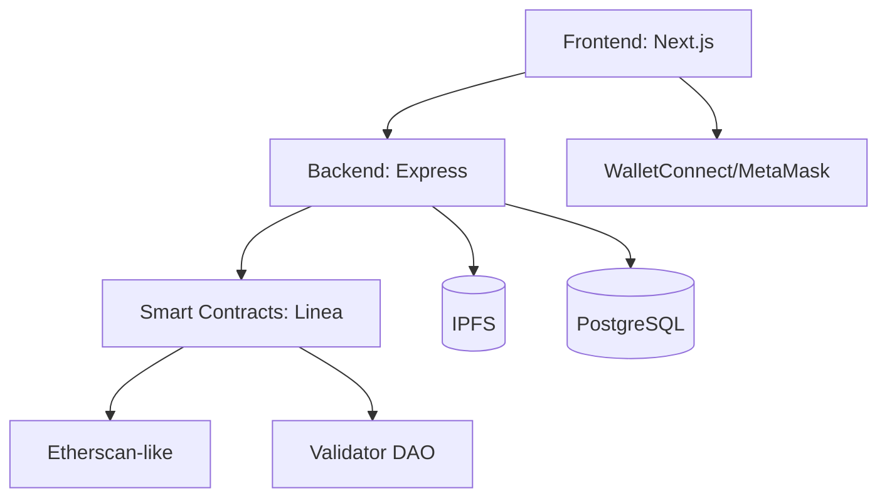

# DeedChain System Architecture

## Overview
DeedChain is a full-stack Web3 application for on-chain land registry, verification, and tokenization.

- Smart contracts on Linea zkEVM (alt: Polygon)
- Frontend: Next.js + Tailwind
- Backend: Node.js + Express + PostgreSQL
- Storage: IPFS/Filecoin
- Governance: DAO validators for verification

## High-Level Diagram

## Data Flows
- Property Registration: UI -> API -> IPFS (metadata) -> SC.mintDeed
- Verification: DAO validators -> SC.verifyDeed
- Transfer: Buyer/Seller signatures -> SC.transferOwnership
- Tokenization: Owner -> SC.fractionalize -> ERC-20 LandShares

## Environments
- Development: Local Hardhat + .env vars
- Staging: Testnet Linea/Polygon
- Production: Linea zkEVM mainnet
